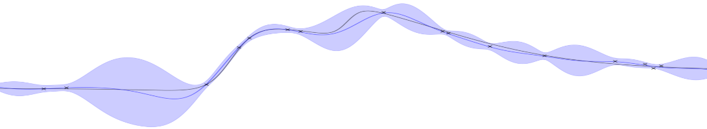

<a href="/location">Location</a> | <a href="/participants">Participants</a> | <a href="/schedule">Schedule</a> | <a href="/talks">Talks</a>

  
# Schedule

Draft schedule of activities, subject to alteration

| | Monday 28 March | Tuesday 29 March |
| --- | --- | --- |
| 09:00–09:10 | Welcome: Chris Oates and Tim Sullivan | |
| 09:10–09:50 | Research Talk: Maren Mahsereci | Research Talk: <a href="/talks#challenor">Peter Challenor</a> [<a href="/pdf/challenor.pdf">Slides</a>] |
| 09:50–10:10 | Research Talk: <a href="/talks#naslidnyk">Masha Naslidnyk</a> <a href="/pdf/naslidnyk.pdf">Slides</a> | Research Talk: <a href="/talks#pentland">Kamran Pentland</a> <a href="/pdf/pentland.pdf">Slides</a>|
| 10:10–10:30 | Refreshment Break | Refreshment Break |
| 10:30–12:30 | Collaborative Research | Collaborative Research |
| 12:30–13:40 | Lunch | Lunch |
| 13:40–14:20 | Research Talk: <a href="/talks#hennig">Philipp Hennig</a> <a href="/pdf/hennig.pdf">Slides</a> | Research Talk: <a href="/talks#karvonen">Toni Karvonen</a> <a href="/pdf/karvonen.pdf">Slides</a> |
| 14:20–14:40 | Research Talk: <a href="/talks#akyildiz">Deniz Akyıldız</a> <a href="/pdf/akyildiz.pdf">Slides</a> | Research Talk: <a href="/talks#lie">Han Cheng Lie</a> |
| 14:40–15:00 | Refreshment Break | Refreshment Break |
| 15:00–17:00 | Collaborative Research | Collaborative Research |
| 17:00 | Free | Closing |
| 18:30 | Workshop Dinner | |
